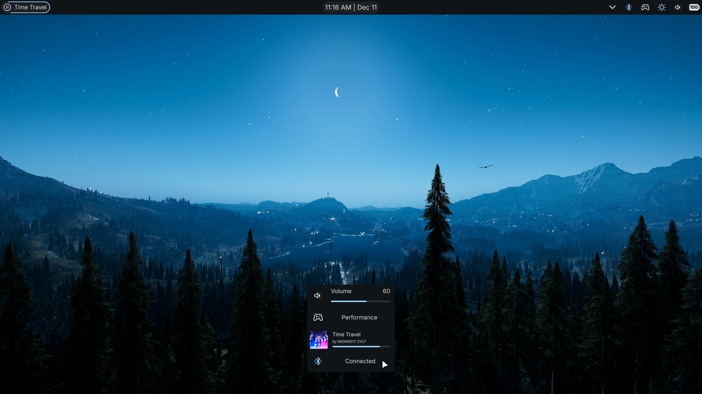

<h1 align="center">whyshell</h1>

Just another minimal(?) quickshell configuration

### Screenshots

### Usage

- `mkdir ~/.config/quickshell`
- `git clone https://github.com/inlinefun/whyshell.git ~/.config/quickshell/whyshell`
- `qs -dnc whyshell`

### Notes

Icons are generated with [svgtoqml](https://doc.qt.io/qt-6/qtqml-tooling-svgtoqml.html)
> Note: svgtoqml is not available in the `$PATH` on arch.
> You could add `/usr/lib/qt6/bin/` to the `$PATH` or use `svgtoqml` from there

### References

- [fufexan's dotfiles](https://github.com/fufexan/dotfiles)
